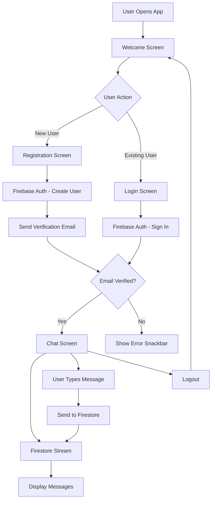
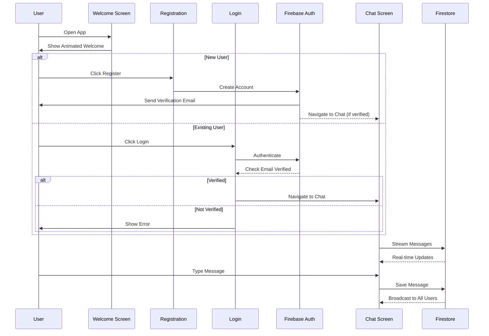

# ⚡ FlashChat - Real-Time Mobile Chat Application

<div align="center">

  
  
  

**A feature-rich real-time messaging application built with Flutter and Firebase**

[Features](#-features) • [Architecture](#-architecture) • [Installation](#-installation) • [Documentation](#-documentation)

</div>

---

## 📋 Table of Contents
- [Overview](#-overview)
- [Features](#-features)
- [Technology Stack](#-technology-stack)
- [Architecture](#-architecture)
  - [Data Flow](#data-flow-architecture)
  - [User Journey](#user-journey-flow)
- [Project Structure](#-project-structure)
- [Installation](#-installation)
- [Firebase Configuration](#-firebase-configuration)
- [Key Components](#-key-components)
- [Screens Overview](#-screens-overview)
- [Technical Highlights](#-technical-highlights)
- [Security Considerations](#-security-considerations)
- [Future Enhancements](#-future-enhancements)
- [Contributing](#-contributing)
- [License](#-license)

---
## 🌟 Overview
**FlashChat** is a modern, real-time messaging application that demonstrates best practices in Flutter development and Firebase integration. The application provides a complete chat experience with user authentication, email verification, and real-time message synchronization across all connected clients.
### Key Statistics
- **Language**: Dart (98.0%)
- **Framework**: Flutter
- **Backend**: Firebase (Authentication + Cloud Firestore)
- **SDK Version**: `>=2.17.1 <3.0.0`

---
## ✨ Features
### Core Functionality
- ✅ **User Authentication**
  - Email/Password registration
  - Secure login system
  - Email verification requirement
  - Password validation
- 💬 **Real-Time Messaging**
  - Instant message delivery
  - Live message updates
  - Message timestamps
  - Sender identification
- 🎨 **Modern UI/UX**
  - Animated welcome screen
  - Typewriter text effects
  - Color tween animations
  - Smooth transitions
  - Loading indicators
- 🔒 **Security Features**
  - Firebase Authentication
  - Email verification checks
  - Secure data transmission
  - User session management
- 📱 **Cross-Platform**
  - iOS support
  - Android support
  - Responsive design
---
## 🛠 Technology Stack
### Frontend Framework
```yaml
Flutter SDK: >=2.17.1 <3.0.0
Dart Language: Latest stable
```
### Backend Services
```yaml
Firebase Core: ^1.17.0
Firebase Auth: ^3.3.18
Cloud Firestore: ^3.1.16
```
### UI Libraries
```yaml
animated_text_kit: ^4.2.1        # Text animations
modal_progress_hud_nsn: ^0.2.1   # Loading indicators
cupertino_icons: ^1.0.2          # iOS icons
```
### Custom Assets
- **Fonts**: Caveat, Josefin Sans (variable fonts)
- **Images**: Custom lightning bolt logo
- **Date Formatting**: intl package
---
## 🏗 Architecture
### Data Flow Architecture

### User Journey Flow

---
## 📁 Project Structure
```
FlashChat/
├── lib/
│   ├── components/              # Reusable UI components
│   │   ├── error_snackbar.dart # Error message display
│   │   └── rounded_button.dart  # Custom button widget
│   ├── screens/                 # Application screens
│   │   ├── welcome_screen.dart  # Landing page with animations
│   │   ├── login_screen.dart    # User authentication
│   │   ├── registration_screen.dart # New user signup
│   │   ├── chat_screen.dart     # Main messaging interface
│   │   └── update_screen.dart   # (Future feature)
│   ├── constants.dart           # UI styling constants
│   └── main.dart               # Application entry point
├── images/                      # Image assets
│   └── logo.png                # App lightning bolt logo
├── fonts/                       # Custom fonts
│   ├── Caveat-VariableFont_wght.ttf
│   └── JosefinSans-VariableFont_wght.ttf
├── firestore.rules             # Firestore security rules
├── pubspec.yaml                # Dependencies & configuration
└── README.md                   # This file
```
---
## 🚀 Installation
### Prerequisites
- Flutter SDK (>=2.17.1 <3.0.0)
- Dart SDK
- Firebase account
- Android Studio / Xcode (for emulators)
- Git
### Step-by-Step Setup
1. **Clone the Repository**
   ```bash
   git clone https://github.com/yourusername/FlashChat-Mobile-Application-Using-Flutter-.git
   cd FlashChat-Mobile-Application-Using-Flutter-
   ```
2. **Install Dependencies**
   ```bash
   flutter pub get
   ```
3. **Firebase Setup**
   - Create a new Firebase project at [Firebase Console](https://console.firebase.google.com/)
   - Enable Email/Password authentication
   - Create a Cloud Firestore database
   - Download `google-services.json` (Android) and `GoogleService-Info.plist` (iOS)
   - Place configuration files in respective directories
4. **Run the Application**
   ```bash
   # Check connected devices
   flutter devices
   
   # Run on specific device
   flutter run -d <device_id>
   
   # Run in debug mode
   flutter run
   ```
5. **Build for Production**
   ```bash
   # Android
   flutter build apk --release
   
   # iOS
   flutter build ios --release
   ```
---
## 🔥 Firebase Configuration
### Authentication Setup
1. Navigate to Firebase Console → Authentication
2. Enable **Email/Password** sign-in method
3. Configure email verification settings (optional)
### Firestore Database
Create a collection named `messages` with the following structure:
```javascript
messages/
  └── <auto_generated_id>
      ├── text: string
      ├── sender: string (email)
      └── timestamp: timestamp
```
### Security Rules
> ⚠️ **Important**: Update the default security rules for production!
Current rules (development only):
```javascript
rules_version = '2';
service cloud.firestore {
  match /databases/{database}/documents {
    match /{document=**} {
      allow read, write: if request.auth != null;
    }
  }
}
```
**Recommended Production Rules:**
```javascript
rules_version = '2';
service cloud.firestore {
  match /databases/{database}/documents {
    match /messages/{messageId} {
      // Allow authenticated users to read all messages
      allow read: if request.auth != null;
      
      // Allow authenticated users to create messages
      allow create: if request.auth != null 
                    && request.resource.data.sender == request.auth.token.email
                    && request.resource.data.keys().hasAll(['text', 'sender', 'timestamp']);
      
      // Prevent editing or deleting messages
      allow update, delete: if false;
    }
  }
}
```
---
## 🧩 Key Components
### 1. Rounded Button Component
**File**: `lib/components/rounded_button.dart`
A reusable button widget providing consistent styling across the application.
```dart
RoundedButton(
  color: Colors.blueAccent,
  title: 'Log In',
  onPressed: () {
    // Handle button press
  },
)
```
**Properties:**
- `color`: Background color
- `title`: Button text
- `onPressed`: Callback function
---
### 2. Error Snackbar Component
**File**: `lib/components/error_snackbar.dart`
Standardized error message display with custom styling.
```dart
ScaffoldMessenger.of(context).showSnackBar(
  snackBar('Invalid credentials. Please try again.')
);
```
**Features:**
- Red background for error visibility
- Floating behavior
- Rounded corners
- Consistent padding
---
### 3. Constants
**File**: `lib/constants.dart`
Centralized UI styling constants for consistency:
- `kSendButtonTextStyle` - Send button text style
- `kMessageTextFieldDecoration` - Message input field decoration
- `kMessageContainerDecoration` - Message container styling
- `kTextFieldDecoration` - General text field decoration
---
## 📱 Screens Overview
### 1. Welcome Screen
**Route**: `/welcome`
**Features:**
- Animated background with color tween
- Typewriter text animation for "Flash Chat"
- Logo display
- Navigation to Login/Registration
**Technical Details:**
- Uses `AnimationController` with `SingleTickerProviderStateMixin`
- `ColorTween` for smooth background color transitions
- `AnimatedTextKit` for typewriter effect
---
### 2. Login Screen
**Route**: `/login`
**Features:**
- Email and password input fields
- Firebase authentication integration
- Email verification check
- Loading spinner during authentication
- Error handling with custom snackbars
**Authentication Flow:**
```
User Input → Firebase Auth → Email Verified? → Chat Screen
                                    ↓ No
                              Error Snackbar
```
**Error Handling:**
- `user-not-found` - User doesn't exist
- `wrong-password` - Invalid credentials
- Email verification required
---
### 3. Registration Screen
**Route**: `/registration`
**Features:**
- New user account creation
- Automatic email verification sending
- Password strength validation
- Duplicate email prevention
**Registration Flow:**
```
User Input → Create Account → Send Verification Email → Navigate to Chat
```
**Error Handling:**
- `weak-password` - Password too weak
- `email-already-in-use` - Account already exists
---
### 4. Chat Screen
**Route**: `/chat`
**Features:**
- Real-time message streaming
- Custom message bubbles
- Sender identification
- Timestamp display
- Message input with send button
- Logout functionality
**Technical Implementation:**
**Firebase Integration:**
```dart
StreamBuilder<QuerySnapshot>(
  stream: _firestore
    .collection('messages')
    .orderBy('timestamp')
    .snapshots(),
  builder: (context, snapshot) {
    // Build message list
  },
)
```
**Message Structure:**
- Message text
- Sender email
- Server timestamp
- Unique message ID
**UI Features:**
- Different bubble colors for current user vs. others
- Timestamps formatted with `intl` package
- Auto-scroll to latest messages
- Text input controller management
---
## 💡 Technical Highlights
### 1. Animation System
**Color Tween Animation:**
```dart
AnimationController controller = AnimationController(
  vsync: this,
  duration: Duration(seconds: 1),
);
Animation animation = ColorTween(
  begin: Colors.blueGrey,
  end: Colors.white,
).animate(controller);
```
**Typewriter Effect:**
```dart
AnimatedTextKit(
  animatedTexts: [
    TypewriterAnimatedText(
      'Flash Chat',
      textStyle: TextStyle(fontSize: 45.0, fontWeight: FontWeight.w900),
      speed: Duration(milliseconds: 150),
    ),
  ],
)
```
---
### 2. Firebase Integration
**User Registration:**
```dart
final newUser = await _auth.createUserWithEmailAndPassword(
  email: email,
  password: password,
);
await FirebaseAuth.instance.currentUser?.sendEmailVerification();
```
**User Login:**
```dart
final user = await _auth.signInWithEmailAndPassword(
  email: email,
  password: password,
);
if (user?.emailVerified ?? false) {
  Navigator.pushNamed(context, ChatScreen.id);
}
```
**Sending Messages:**
```dart
_firestore.collection('messages').add({
  'text': messageText,
  'sender': loggedInUser.email,
  'timestamp': FieldValue.serverTimestamp(),
});
```
---
### 3. State Management
Currently using `setState()` for state updates. The app manages:
- Loading states (`showSpinner`)
- User input (email, password, messages)
- Authentication state
- Message stream
---
### 4. Error Handling
**Try-Catch Blocks:**
```dart
try {
  final user = await _auth.signInWithEmailAndPassword(
    email: email,
    password: password,
  );
} on FirebaseAuthException catch (e) {
  if (e.code == 'user-not-found') {
    // Handle user not found
  } else if (e.code == 'wrong-password') {
    // Handle wrong password
  }
} catch (e) {
  // Handle general errors
}
```
---
## 🔒 Security Considerations
### Current Implementation
✅ **Implemented Security Features:**
- Firebase Authentication
- Email verification requirement
- Secure password storage (handled by Firebase)
- Server-side timestamp for messages
- HTTPS encryption for data transmission
### Areas for Improvement
⚠️ **Security Recommendations:**
1. **Firestore Rules**: Update security rules to restrict data access
2. **Email Verification**: Enforce verification before chat access
3. **Password Requirements**: Add client-side password strength validation
4. **Rate Limiting**: Implement message sending rate limits
5. **Input Validation**: Add comprehensive input sanitization
6. **User Privacy**: Implement user blocking/reporting features
---
## 🚧 Future Enhancements
### Planned Features
#### 🎯 Phase 1: Core Improvements
- [ ] User profiles with display names
- [ ] User avatars
- [ ] Dark mode support
- [ ] Improved state management (Provider/Bloc)
- [ ] Comprehensive unit tests
#### 🎯 Phase 2: Messaging Features
- [ ] Message editing and deletion
- [ ] Read receipts
- [ ] Typing indicators
- [ ] Image/file sharing
- [ ] Emoji picker
- [ ] Message reactions
#### 🎯 Phase 3: Advanced Features
- [ ] Group chat functionality
- [ ] Push notifications
- [ ] Voice messages
- [ ] Video calls
- [ ] User online/offline status
- [ ] Message search
- [ ] Chat encryption
#### 🎯 Phase 4: Performance & UX
- [ ] Offline data persistence
- [ ] Message pagination
- [ ] Image compression
- [ ] Background sync
- [ ] App analytics
- [ ] Crash reporting
---
## 📊 Code Quality Metrics
### File Structure Analysis
| Component | Files | Primary Purpose | Complexity |
|-----------|-------|-----------------|------------|
| Screens | 5 | UI screens & navigation | Medium |
| Components | 2 | Reusable widgets | Low |
| Services | 0 | Firebase integration (inline) | - |
| Utils | 1 | Constants & helpers | Low |
### Screen Complexity
| Screen | Estimated LOC | State Variables | Firebase Calls |
|--------|--------------|-----------------|----------------|
| Welcome | ~70 | 2 (animation) | 0 |
| Login | ~110 | 3 (email, password, spinner) | 1 (signIn) |
| Registration | ~115 | 3 (email, password, spinner) | 2 (create, verify) |
| Chat | ~170 | 3 (text, controller, user) | 2 (stream, add) |
---
## 🐛 Known Issues
1. **Email Verification Bypass**: The `?? true` fallback in registration screen may allow unverified users
2. **Firestore Rules**: Current rules are too permissive for production
3. **Error Logging**: `myBackend.sendError` references undefined object in main.dart
4. **State Management**: Using `setState` limits scalability
5. **No Offline Support**: Messages not cached for offline access
---
## 🤝 Contributing
We welcome contributions! Please follow these steps:
1. **Fork the repository**
2. **Create a feature branch**
   ```bash
   git checkout -b feature/amazing-feature
   ```
3. **Commit your changes**
   ```bash
   git commit -m 'Add some amazing feature'
   ```
4. **Push to the branch**
   ```bash
   git push origin feature/amazing-feature
   ```
5. **Open a Pull Request**
### Contribution Guidelines
- Follow Flutter/Dart style guide
- Add tests for new features
- Update documentation
- Ensure code passes linting
- Test on both iOS and Android
---
## 📄 License
This project is licensed under the MIT License - see the [LICENSE](LICENSE) file for details.
---
## 👥 Authors
- **Original Developer** - Initial work and architecture
---
## 🙏 Acknowledgments
- Flutter team for the amazing framework
- Firebase team for backend infrastructure
- `animated_text_kit` package for text animations
- `modal_progress_hud_nsn` for loading indicators
- Font creators: Caveat and Josefin Sans
---
## 📞 Support
For support, please:
- Open an issue on GitHub
- Check existing documentation
- Review Firebase documentation for backend issues
---
## 🔗 Resources
### Documentation
- [Flutter Documentation](https://flutter.dev/docs)
- [Firebase Documentation](https://firebase.google.com/docs)
- [Dart Language Tour](https://dart.dev/guides/language/language-tour)
### Related Packages
- [firebase_core](https://pub.dev/packages/firebase_core)
- [firebase_auth](https://pub.dev/packages/firebase_auth)
- [cloud_firestore](https://pub.dev/packages/cloud_firestore)
- [animated_text_kit](https://pub.dev/packages/animated_text_kit)
---

<div align="center">

  **⚡ FlashChat - Connecting people in real-time ⚡**

Made with ❤️ using Flutter

[Report Bug](https://github.com/yourusername/FlashChat/issues) • [Request Feature](https://github.com/yourusername/FlashChat/issues)

</div>
